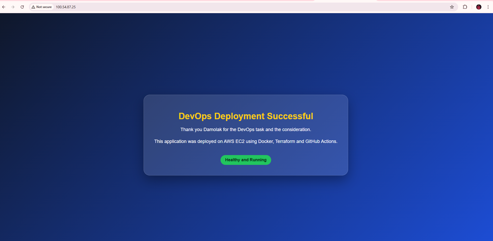
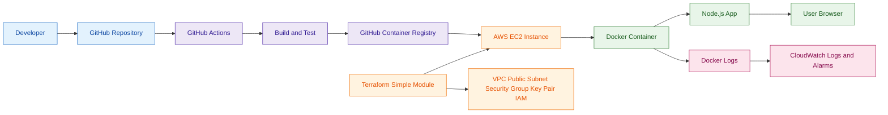

# Complete DevOps Project in Deploying EC2C Infrastructure with Terraform and Nodejs Application Template

Welcome to the Nodejs application deployed on Amazon Web Services (AWS) EC2. This document provides a detailed introduction and instruction to the deployment, highlighting the key components and technologies involved. This repository serves as a demo project for a complete end-to-end DevOps processes, ranging from infrastructure provisioning using terraform, unit test code, containerization, deploying the containerized image, logging and monitoring, showcasing how to use various DevOps technology to set up and run an automation using Github CI/CD pipeline. 




## Deployment Structure
The deployment consist of the following components
# Components

| Component                  |  |
|----------------------------|----------|
| 1. VPC                     |    ✅   |
| 2. Public Subnets |  ✅   |
| 3. Route Tables            |    ✅   |
| 4. NAT Gateways            |    ✅   |
| 5. EC2 Instance (Node)     |    ✅   |
| 6. EC2 Private Key                    |    ✅   |


## Getting Started 

### Prerequisites

Before you begin, ensure you have the following prerequisites in place:

1. **Ubuntu/Amazon Linux Machine**: This Deployment is designed to run on an Ubuntu Linux machine. Ensure you have an Ubuntu-based system available.

2. **AWS CLI Installed and Access Keys Configured**: To interact with AWS services, you'll need the AWS Command Line Interface (CLI) installed on your machine. Additionally, configure your AWS access keys to authenticate with AWS. You can set up access keys using the `aws configure` command.

3. **Terraform Installed**: This project relies on Terraform for infrastructure provisioning. Make sure you have Terraform installed on your Ubuntu machine. You can find installation instructions for Terraform on the [official Terraform website](https://www.terraform.io/downloads.html).


## 1. Source Code

This repository contains a simple Node.js application that displays:

> Thank you Damolak for the DevOps task and the consideration.

The application has:

- `/` landing page
- `/health` health check endpoint
- Dockerfile
- Basic Node.js test

Application files are inside:

```text
app/
```

Run locally:

```bash
cd app
npm install
npm test
npm start
```

Open:

```text
http://localhost:3000
```

## 2. Infrastructure Code Terraform

Terraform is intentionally kept simple.

There is only one reusable module:

```text
terraform/modules/ec2_app
```

The root Terraform code simply references this module:

```hcl
module "ec2_app" {
  source = "./modules/ec2_app"

  aws_region        = var.aws_region
  project_name      = var.project_name
  instance_type     = var.instance_type
  allowed_ssh_cidr  = var.allowed_ssh_cidr
  allowed_http_cidr = var.allowed_http_cidr
}
```

The module creates:

- VPC
- Public subnet
- Internet gateway
- Route table
- Security group
- Terraform-generated SSH key pair
- EC2 instance
- IAM role for CloudWatch logs
- CloudWatch log group
- CloudWatch alarms

### SSH Key Pair

Terraform creates the SSH key pair using:

- `tls_private_key`
- `aws_key_pair`
- `local_sensitive_file`

The public key is uploaded to AWS and attached to the EC2 instance.

The private key is saved locally as:

```text
devops-ec2-task.pem
```

> Note: For production, avoid storing private keys in Terraform state. Use AWS Systems Manager Session Manager or external key management.

### Deploy Infrastructure

```bash
cd terraform
terraform init
terraform validate
terraform plan -var="allowed_ssh_cidr=YOUR_PUBLIC_IP/32"
terraform apply -var="allowed_ssh_cidr=YOUR_PUBLIC_IP/32"
```

After deployment, Terraform prints:

- Application URL
- EC2 public IP
- Private key path
- SSH command
- CloudWatch log group

## 3. CI/CD Pipeline

The GitHub Actions workflow is located here:

```text
.github/workflows/deploy.yml
```

The pipeline performs:

1. Checkout code
2. Install Node.js dependencies
3. Run tests
4. Build Docker image
5. Push image to GitHub Container Registry
6. SSH into EC2
7. Pull latest Docker image
8. Stop old container
9. Start new container
10. Run health check

### GitHub Secrets Required

Create these secrets in your GitHub repository:

```text
AWS_REGION
EC2_HOST
EC2_USER
EC2_SSH_PRIVATE_KEY
```

Recommended values:

```text
AWS_REGION=eu-west-2
EC2_USER=ec2-user
EC2_HOST=<terraform-output-instance-public-ip>
EC2_SSH_PRIVATE_KEY=<content-of-devops-ec2-task.pem>
```

To get the private key content:

```bash
cat terraform/devops-ec2-task.pem
```

## 4. Observability

This solution includes basic observability:

- Application health endpoint: `/health`
- Docker health check
- CloudWatch Logs
- CloudWatch EC2 status check alarm
- CloudWatch high CPU alarm
- Docker restart policy: `unless-stopped`

CloudWatch log group:

```text
/ec2/devops-ec2-task/app
```

Useful commands on EC2:

```bash
docker ps
docker logs devops-ec2-task-app
curl http://localhost/health
```

## 5. Documentation

### Architecture Diagram



### Design Decisions

- EC2 was selected because the task allows EC2, ECS or EKS, and EC2 is simple for demonstrating end-to-end automation.
- Docker was used to package the application consistently.
- GitHub Actions was selected as the preferred CI/CD tool.
- Terraform was used for repeatable infrastructure provisioning.
- The Terraform structure uses one simple module to avoid unnecessary complexity.
- CloudWatch was used for basic AWS-native logging and monitoring.

### Assumptions

- AWS credentials are configured locally before running Terraform.
- The GitHub repository has package publishing enabled.
- The EC2 public IP is used directly for this task.
- HTTPS and custom domain are not included in this simple version.

### Limitations and Improvements

Possible future improvements:

- Add Application Load Balancer
- Add ACM certificate and HTTPS
- Add Route 53 DNS
- Add Auto Scaling Group
- Replace SSH deployment with AWS Systems Manager
- Add GitHub OIDC for AWS authentication
- Add Docker image vulnerability scanning
- Add Terraform remote backend using S3 and DynamoDB

## End-to-End Workflow

```text
Developer pushes code to main
        ↓
GitHub Actions starts
        ↓
Application test runs
        ↓
Docker image is built
        ↓
Image is pushed to GitHub Container Registry
        ↓
GitHub Actions connects to EC2 using SSH
        ↓
EC2 pulls latest image
        ↓
Existing container is stopped and removed
        ↓
New container starts on port 80
        ↓
Health check confirms deployment
        ↓
User accesses application from browser
```
