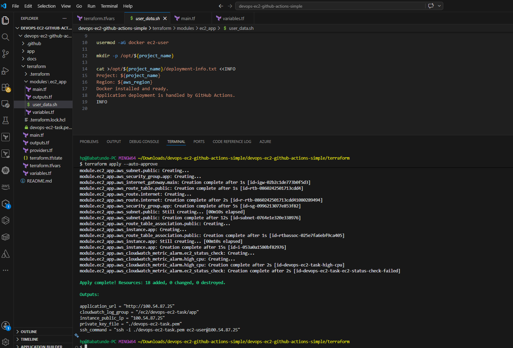
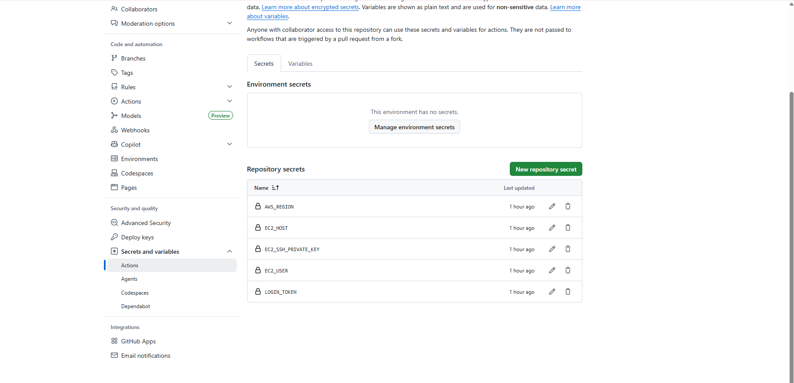
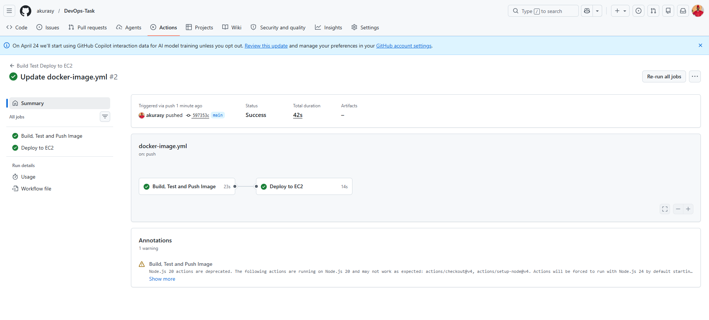
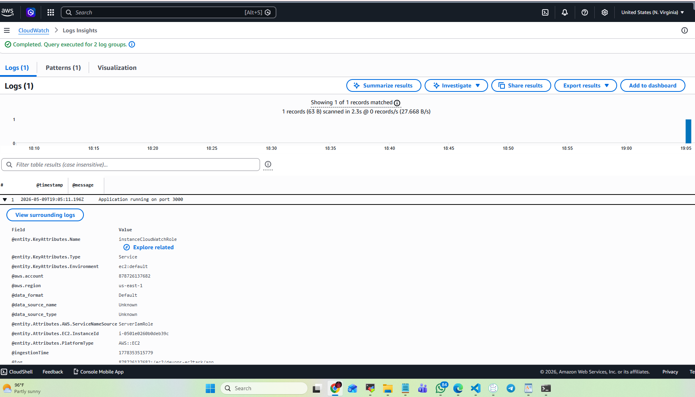
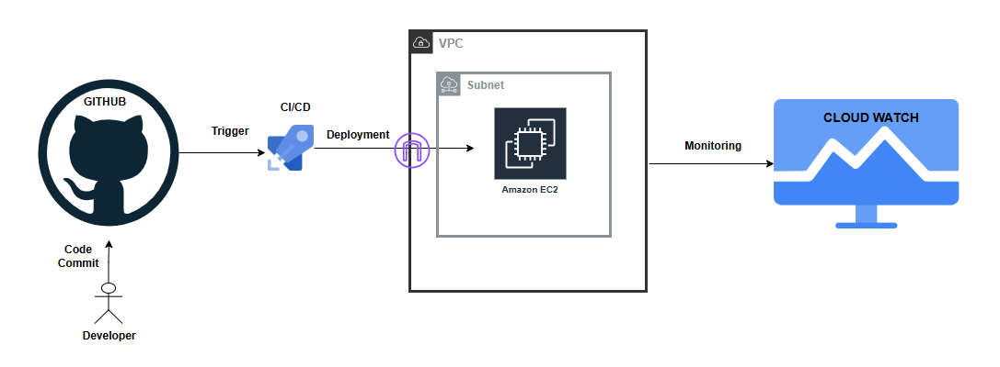

# Complete DevOps Project in Deploying EC2C Infrastructure with Terraform and Nodejs Application Template

Welcome to the Nodejs application deployed on Amazon Web Services (AWS) EC2. This document provides a detailed introduction and instruction to the deployment, highlighting the key components and technologies involved. This repository serves as a demo project for a complete end-to-end DevOps processes, ranging from infrastructure provisioning using terraform, unit test code, containerization, deploying the containerized image, logging and monitoring, showcasing how to use various DevOps technology to set up and run an automation using Github CI/CD pipeline. 


## Deployment Structure
The deployment consist of the following components
# Components

| Component                  |  |
|----------------------------|----------|
| 1. VPC                     |    ✅   |
| 2. Public Subnets |  ✅   |
| 3. Route Tables            |    ✅   |
| 4. NAT Gateways            |    ✅   |
| 5. EC2 Instance (Node)     |    ✅   |
| 6. EC2 Private Key                    |    ✅   |


## Getting Started 

### Prerequisites

Before you begin, ensure you have the following prerequisites in place:

1. **Ubuntu/Amazon Linux Machine**: This Deployment is designed to run on an Ubuntu Linux machine. Ensure you have an Ubuntu-based system available.

2. **AWS CLI Installed and Access Keys Configured**: To interact with AWS services, you'll need the AWS Command Line Interface (CLI) installed on your machine. Additionally, configure your AWS access keys to authenticate with AWS. You can set up access keys using the `aws configure` command.

3. **Terraform Installed**: This project relies on Terraform for infrastructure provisioning. Make sure you have Terraform installed on your Ubuntu machine. You can find installation instructions for Terraform on the [official Terraform website](https://www.terraform.io/downloads.html).


# STEP1 (Infrastructure Provisioning)
Before you begin this, a basic understanding of terraform is required. Look into the terraform script and change the variables to suite your deployment.
Clone this repository and run aws configure in your server by running the command:

```
aws configure
#use your iam secret key, access key and region to set up permission for your terraform server.
```

```
git clone https://github.com/akurasy/DevOps-Task.git
```

change directory to the terraform directory where all infrastructure code is kept.

```
cd terraform
```

# Update the terraform.tfvars to suit your infratsructrure region and other details

run the following commands to provision your infrastructure 

```
terraform init
terraform plan
terraform apply --auto-approve
```




# STEP2 (Application Deployment with Github Actions)
1.  push the code to your git repository
2.  update your repository secrets
   

3. commit your changes for workflow to trigger. For this project, the workflow is deployed to the main branch.

   


# Step3 (Monitoring and Observability)

Goto AWS Cloudwatch and select the workgroup defined in the deployment flow. view the log insight to see the application logs. 



# Documentation


# Architectural Diagram 




### Design Decisions

- EC2 was selected because the task allows EC2, ECS or EKS, and EC2 is simple for demonstrating end-to-end automation.
- Docker was used to package the application consistently.
- GitHub Actions was selected as the preferred CI/CD tool.
- Terraform was used for repeatable infrastructure provisioning.
- The Terraform structure uses one simple module to avoid unnecessary complexity.
- CloudWatch was used for basic AWS-native logging and monitoring.

### Assumptions

- AWS credentials are configured locally before running Terraform.
- The GitHub repository has package publishing enabled.
- The EC2 public IP is used directly for this task.
- HTTPS and custom domain are not included in this simple version.

### Limitations and Improvements

Possible future improvements:

- Add Application Load Balancer
- Add ACM certificate and HTTPS
- Add Route 53 DNS
- Add Auto Scaling Group
- Replace SSH deployment with AWS Systems Manager
- Add GitHub OIDC for AWS authentication
- Add Docker image vulnerability scanning
- Add Terraform remote backend using S3 and DynamoDB

